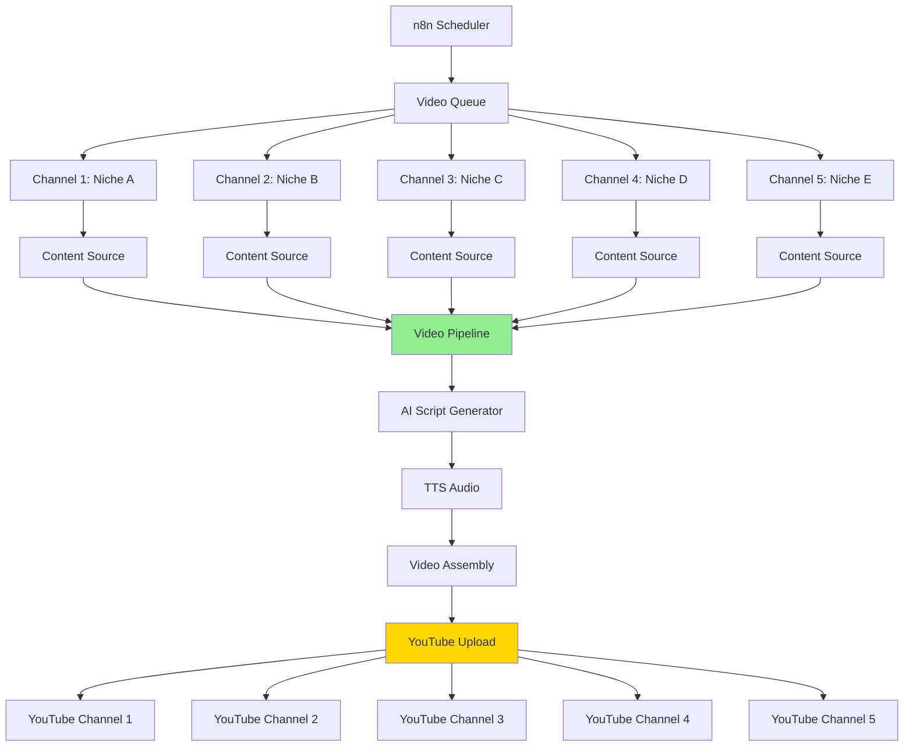

# Mission Alpha - Content Factory Roadmap

**Multi-Channel Automated Video Factory** | Scale: 20+ videos/day across multiple niches

---

## 🎯 Vision

**Goal:** Fully automated content factory generating 20+ videos daily across 5+ YouTube channels

**Target Metrics:**
- **Channels:** 5+ (configurable niches)
- **Output:** 4 videos/channel/day = 20 videos/day minimum
- **Processing Time:** <2 minutes per video (40 min total for 20 videos)
- **Automation:** 100% hands-free (scheduled generation + auto-upload)
- **Cost:** Free tier providers (Groq, Edge TTS, Pexels)

---

## 🔌 System Wiring Flow



---

## ✅ Phase 1: Core Plugin Architecture (COMPLETE)

**Status:** Production-ready ✅

- [x] Provider interfaces (Content, AI, TTS, Video, Upload, Database)
- [x] Plugin loader with dynamic imports
- [x] Plugin registry system
- [x] Pydantic config models
- [x] Rich logging system
- [x] Provider swapping (zero code changes)

**Deliverable:** Modular, extensible architecture

---

## 🔄 Phase 2: Single-Channel MVP (80% COMPLETE)

**Status:** Working but needs optimization ⚠️

### Content Providers
- [x] Quotes API (motivational niche)
- [x] Facts provider
- [ ] **Template system** for multi-niche support

### AI Providers
- [x] Groq (llama-3.3-70b-versatile) - Primary
- [x] Gemini fallback
- [x] OpenAI fallback
- [x] AI fallback chain
- [ ] Niche-specific prompt templates

### TTS Providers
- [x] Edge TTS (natural Hindi voice) ✅
- [x] gTTS (basic fallback)
- [ ] Multi-language support
- [ ] Voice variety per channel

### Video Assembly
- [x] MoviePy provider
- [x] Pexels backgrounds ✅ (working but slow)
- [x] Gradient backgrounds
- [ ] **Performance optimization** (CRITICAL)
- [ ] Template-based styling per niche

### Database
- [x] SQLite (local)
- [ ] Supabase (cloud, for multi-machine)

**Blockers:**
- Video export too slow (8m50s per video)
- No multi-niche support yet

---

## 🚀 Phase 3: Performance Optimization (CRITICAL - IN PROGRESS)

**Goal:** <2 min per video (from current 8m50s)

**Priority:** HIGH - Blocking scale-up

### Video Export Optimization
- [ ] Pre-process Pexels videos (resize/crop once, cache forever)
- [ ] GPU encoding (NVENC if available)
- [ ] Lower resolution option (720p for testing)
- [ ] Parallel processing (4-5 videos at once)
- [ ] Cloud rendering option (AWS Lambda, Replicate)

### Content Caching
- [ ] Cache AI-generated scripts
- [ ] Cache TTS audio files
- [ ] Reuse processed backgrounds

### Target Metrics
- [ ] Video export: <1 minute
- [ ] Full pipeline: <2 minutes per video
- [ ] Batch processing: 20 videos in <40 minutes

**Success Criteria:** Can generate 20 videos in under 1 hour

---

## 📦 Phase 4: Multi-Niche Content System (NOT STARTED)

**Goal:** Support 5+ different content niches with unique sources

### Content Source Plugins (Expandable)
- [ ] Reddit scraper/API (confessions, stories, AITA)
- [ ] News API (trending topics, breaking news)
- [ ] Celebrity/Gossip aggregator (TMZ, E! News)
- [ ] Motivational quotes (current - expand)
- [ ] Story generator (AI-generated narratives)
- [ ] Twitter/X trending topics
- [ ] RSS feed aggregator (any niche)

### Niche Configuration System
```yaml
# config/niches/confession.yaml
niche:
  name: "Reddit Confessions"
  content_source: reddit
  subreddits: ["confession", "offmychest"]
  ai_prompt_template: "confession_script.txt"
  voice: "en-female-dramatic"
  background_theme: "dark_moody"
  upload_channel: "channel_1"
```

### Template System
- [ ] Niche-specific AI prompts
- [ ] Visual style templates (backgrounds, colors, fonts)
- [ ] Voice selection per niche
- [ ] Thumbnail templates
- [ ] Title/description generators

**Deliverable:** Config-driven multi-niche support

---

## 🤖 Phase 5: Full Automation Layer (NOT STARTED)

**Goal:** 100% hands-free operation

### Scheduling & Queue System
- [ ] n8n workflow integration
- [ ] Cron-based scheduling (4 videos/day per channel)
- [ ] Video queue management
- [ ] Priority system (trending content first)
- [ ] Retry logic for failures

### YouTube Integration
- [ ] OAuth 2.0 authentication
- [ ] Auto-upload to multiple channels
- [ ] Metadata optimization (title, description, tags)
- [ ] Thumbnail generation & upload
- [ ] Playlist management
- [ ] Publishing schedule

### Monitoring & Recovery
- [ ] Error tracking (Sentry or similar)
- [ ] Success/failure notifications (email, Slack)
- [ ] Auto-retry failed videos
- [ ] Daily summary reports
- [ ] Analytics dashboard

### Multi-Platform Support (Optional)
- [ ] Instagram Reels
- [ ] TikTok
- [ ] Facebook Reels
- [ ] Twitter/X video

**Deliverable:** Fully automated content factory

---

## 🐳 Phase 6: Infrastructure & Deployment (NOT STARTED)

**Goal:** Scalable, production-ready deployment

### Docker & Containerization
- [ ] Dockerfile (multi-stage build)
- [ ] Docker Compose (all services)
- [ ] Environment variable management
- [ ] Volume mounts (cache, output)

### Cloud Deployment
- [ ] AWS/GCP deployment guide
- [ ] Auto-scaling configuration
- [ ] GPU instance setup (for video processing)
- [ ] Cost optimization

### Database & Storage
- [ ] Supabase production setup
- [ ] S3/Cloud Storage for videos
- [ ] Backup strategy
- [ ] Analytics tables

### CI/CD
- [ ] GitHub Actions workflow
- [ ] Automated testing
- [ ] Deployment pipeline

**Deliverable:** Production-ready infrastructure

---

## 🎨 Phase 7: Advanced Features (FUTURE)

### AI Enhancements
- [ ] AI-generated talking avatars (SadTalker, D-ID)
- [ ] Multi-agent collaboration (CrewAI)
- [ ] A/B testing for hooks
- [ ] Sentiment analysis
- [ ] Trend prediction

### Video Quality
- [ ] Word-by-word captions
- [ ] Dynamic animations
- [ ] Transitions & effects
- [ ] Background music
- [ ] Sound effects

### Analytics & Optimization
- [ ] View tracking
- [ ] Engagement metrics
- [ ] Performance dashboard
- [ ] Auto-optimization (learn from best performers)
- [ ] Competitor analysis

### Monetization
- [ ] Ad revenue tracking
- [ ] Sponsorship integration
- [ ] Affiliate link insertion
- [ ] Merchandise promotion

---

## 📊 Integration Tracker

### Third-Party Services

| Service | Purpose | Status | Priority | Cost |
|---------|---------|--------|----------|------|
| **Groq** | AI script generation | ✅ Active | Critical | Free |
| **Edge TTS** | Voice synthesis | ✅ Active | Critical | Free |
| **Pexels** | Video backgrounds | ✅ Working | High | Free |
| **YouTube API** | Auto-upload | ❌ Not started | Critical | Free |
| **n8n** | Workflow automation | ❌ Not started | High | Free (self-hosted) |
| **Supabase** | Cloud database | ⚪ Setup only | Medium | Free tier |
| **Reddit API** | Content source | ❌ Not started | High | Free |
| **News API** | Content source | ❌ Not started | Medium | Free tier |
| **D-ID/SadTalker** | AI avatars | ❌ Not started | Medium | Free/Paid |
| **Docker** | Deployment | ❌ Not started | High | Free |

---

## 🎯 Current Sprint (Next 2 Weeks)

### Week 1: Performance Optimization
1. Pre-process Pexels videos (cache resized versions)
2. Implement parallel video generation
3. Test GPU encoding (if available)
4. Target: <2 min per video

### Week 2: Multi-Niche Foundation
1. Create niche configuration system
2. Implement Reddit content provider
3. Add News API provider
4. Test with 2-3 different niches

**Success Metric:** Generate 10 videos (2 niches × 5 videos) in <30 minutes

---

## 📈 Success Metrics

### Current State
- ✅ Single niche working (motivational)
- ⚠️ 8m50s per video (too slow)
- ✅ Pexels backgrounds working
- ❌ No automation

### Target State (3 Months)
- 🎯 5+ niches operational
- 🎯 <2 min per video
- 🎯 20 videos/day automated
- 🎯 Auto-upload to YouTube
- 🎯 100% hands-free

### Long-term Vision (6 Months)
- 🎯 10+ channels
- 🎯 50+ videos/day
- 🎯 Multi-platform distribution
- 🎯 AI avatars integrated
- 🎯 Revenue optimization

---

## 🔧 Configuration Philosophy

**Everything is configurable via YAML:**

```yaml
# config/factory.yaml
factory:
  channels: 5
  videos_per_channel: 4
  schedule: "0 */6 * * *"  # Every 6 hours
  
niches:
  - name: "Confessions"
    content: reddit
    voice: en-female
    style: dark
    
  - name: "News"
    content: news_api
    voice: en-male
    style: professional
```

**No hardcoding** - add new niches without touching code!

---

**Last Updated:** 2025-12-26
**Next Review:** After Phase 3 completion (performance optimization)
